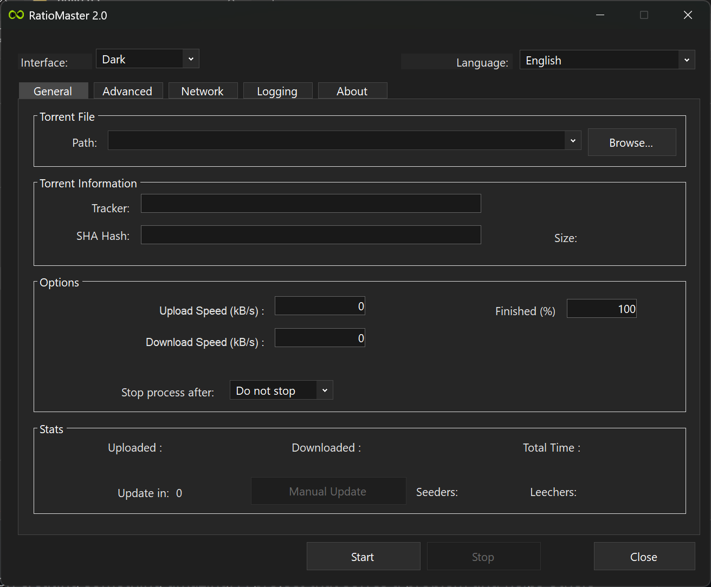

<a id="readme-top"></a>

[![.NET 10][dotnet-shield]][dotnet-url]
[![Windows App][windows-shield]][windows-url]
[![Issues][issues-shield]][issues-url]
[![License: GPL 3.0][license-shield]][license-url]

<br />
<div align="center">
  

  <h1 align="center">RatioMaster 2.0</h1>

  <p align="center">
    A modernized RatioMaster release for spoofing torrent tracker upload/download announce data.
    <br />
    <a href="https://github.com/BagerRyg/RatioMaster2/issues">Report Bug</a>
    &middot;
    <a href="https://github.com/BagerRyg/RatioMaster2/issues">Request Feature</a>
  </p>
</div>

## Latest Release: Build 75

September 16, 2026. App build **75**, executable version **2.0.0.75**.

Changes since Build 73:

* Added client profiles for qBittorrent 5.2.3, uTorrent 3.6.0 (47254), BitTorrent 7.11.0 (47255), rTorrent 0.16.22 / ruTorrent 5.3.14, Transmission 4.1.3, Halite 0.4.0.4, and BitTyrant 1.1.1. qBittorrent 5.2.3 is the default.
* Updated affected announce templates, headers, peer-ID generation, and key formats, including fixes for existing qBittorrent and Deluge profiles. Historical profiles remain under Legacy. See the [client audit](docs/CLIENTS.md) for verification limits and clients still awaiting verified updates.
* Saved client selections now use stable profile IDs so database reordering does not change the selected client. Added migration for older index-based settings and fallback handling for missing profiles.
* Changed **Seeded ~1.2x** to choose one random target per session between **1.18x and 1.25x** the torrent's total size. The stop condition uses reported uploaded bytes, not actual transferred torrent data.
* Updated the stop-option text across all **24 language locales**.
* Added offline regression tests covering **57 client profiles**, request formatting, generated IDs and keys, and saved-selection migration. Tests send no tracker requests.
* Disabled release debug symbols and mapped source paths to a generic location. Release optimization is enabled and the `DEBUG` compilation flag is absent. Removed old Build 73 output from Git tracking; generated builds, debug files, logs, and local torrent settings are excluded. Previously committed files remain in Git history.

Build 75 supports a self-contained Windows x64 EXE that needs no installed .NET runtime. See [Build From Source](#build-from-source); keep the accompanying client, language, and default-config files beside the EXE.

## Introduction

RatioMaster 2.0 is an improved and modified version of RatioMaster v1.9.1. The application was modernized by decompiling the original RatioMaster v1.9.1 source by Ratiomaster_06/Moofdev, then updating and extending it.

All original credits go to Ratiomaster_06/Moofdev.

## About The Project

RatioMaster 2.0 is a Windows application used to spoof upload and download statistics to a torrent tracker. It does not upload real torrent data to peers. The only data being sent is tracker announce data, such as reported uploaded/downloaded amounts, selected client identity, peer ID, key, port, and related tracker parameters.

Use it carefully. Tracker behavior and rules vary.

<p align="right">(<a href="#readme-top">back to top</a>)</p>

## Screenshots



<p align="right">(<a href="#readme-top">back to top</a>)</p>

## Features

RatioMaster 2.0 introduces a new set of features, improvements, and changes:

* Improved UI, with the addition of Dark Mode.
* Updated framework from old .NET 8 -> .NET 10
* Improved stability and security.
* Client profiles include qBittorrent 5.2.3, uTorrent 3.6.0 (47254), BitTorrent 7.11.0 (47255), Deluge 2.2.0, rTorrent 0.16.22 / ruTorrent 5.3.14, Transmission 4.1.3, Halite 0.4.0.4, and BitTyrant 1.1.1. See the [client audit](docs/CLIENTS.md) for sources and verification limits.
* Improved tracker/announce response.
* Torrent files containing multiple announce URLs are now supported correctly and working.
* Fixed an issue where the client could stall for up to 15 minutes before updating the tracker.
* Improved logging tab.
* **Hide confidential info** masks sensitive tracker values, peer IDs, hashes, and keys in the log view and its saved output when enabled. It is enabled by default.
* Removed the auto-update function, as it was hitting a dead endpoint anyway.
* Many other minor tweaks and improvements.

<p align="right">(<a href="#readme-top">back to top</a>)</p>

## Built With

* C#
* Windows Forms
* .NET 10

<p align="right">(<a href="#readme-top">back to top</a>)</p>

## Getting Started

Build the current release from source with the .NET SDK. Generated executable builds are not tracked in the source repository.

### Prerequisites

* Windows
* .NET 10 Runtime for published framework-dependent builds
* .NET 10 SDK if building from source

### Build From Source

```powershell
dotnet publish ".\Source\RM.csproj" -c Release -r win-x64 --self-contained false -o ".\Build X"
```

Replace `Build X` with the next numbered build folder.

For a self-contained build that does not require an installed .NET runtime:

```powershell
dotnet publish ".\Source\RM.csproj" -c Release -r win-x64 --self-contained true -p:PublishSingleFile=true -p:PublishReadyToRun=false -o ".\Build X\Standalone"
```

Keep the generated `clients`, `lng`, and `ratiomaster.config` beside `RM.exe`. Release builds disable debug symbols and map source paths to a generic location. Build output, debug files, logs, and local torrent settings are excluded from Git.

<p align="right">(<a href="#readme-top">back to top</a>)</p>

## Usage

1. Open RatioMaster 2.0.
2. Load a `.torrent` file.
3. Select the torrent client profile you want to emulate.
4. Configure upload/download values and tracker settings.
5. Start the announce session.

The app reports spoofed announce data to the tracker. It does not transfer actual torrent payload data to peers.

<p align="right">(<a href="#readme-top">back to top</a>)</p>

## Bugs And Feedback

Please report bugs, feedback, or feature requests via GitHub issues:

[https://github.com/BagerRyg/RatioMaster2/issues](https://github.com/BagerRyg/RatioMaster2/issues)

<p align="right">(<a href="#readme-top">back to top</a>)</p>

## License

Distributed under the GNU General Public License v3.0. See [LICENSE](LICENSE) for more information.

<p align="right">(<a href="#readme-top">back to top</a>)</p>

## Disclaimer

I take absolutely no responsibility. Use the program at your own risk.

I have run and tested the program against different trackers for an extended period without any warnings or detections, but use it conservatively and with reasonable use.

The program comes with ZERO warranty.

<p align="right">(<a href="#readme-top">back to top</a>)</p>

## Acknowledgments

* Original RatioMaster v1.9.1 by Ratiomaster_06/Moofdev.
* Original credits belong to the original authors.

<p align="right">(<a href="#readme-top">back to top</a>)</p>

[dotnet-shield]: https://img.shields.io/badge/.NET-10-blue?style=for-the-badge
[dotnet-url]: https://dotnet.microsoft.com/
[windows-shield]: https://img.shields.io/badge/Windows-app-lightblue?style=for-the-badge
[windows-url]: https://www.microsoft.com/windows
[issues-shield]: https://img.shields.io/github/issues/BagerRyg/RatioMaster2.svg?style=for-the-badge&color=red
[issues-url]: https://github.com/BagerRyg/RatioMaster2/issues
[license-shield]: https://img.shields.io/badge/License-GPL%203.0-green?style=for-the-badge
[license-url]: LICENSE
